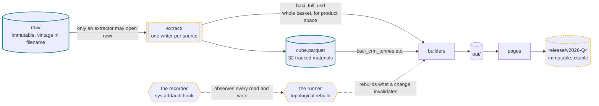
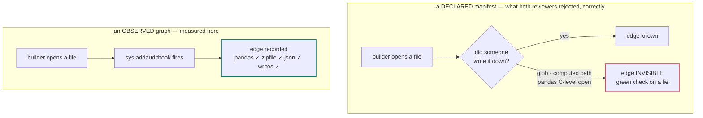
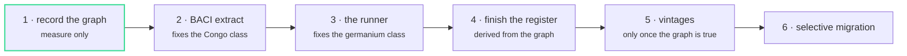

# Data architecture

How data moves through this project, what is enforced, and what is deliberately not built.

Written 7 Sep 2026 after two adversarial reviews; numbers re-measured 9 Sep from the recorded
graph. Every number here is observed, not estimated: `record_graph.py` runs each builder under
`sys.addaudithook` and writes what it actually opened to `out/graph.json`.

---

## 1. The system as it actually is

Not as it should be. An earlier draft of this document drew `raw → extract → cube → out → release`
and called the cube the spine. That diagram was aspiration. Measured:

| | |
|---|---|
| builders recorded / ran clean | 277 / 272 |
| builders that open `cube.parquet` | **7** |
| analysis families that read the cube | **0 of 13** |
| builders that open raw BACI archives themselves | **56** |
| ...that separately read the country-code file | **53** |
| builders that read another builder's `out/` | **107** (395 edges) |
| artifacts with more than one writer | **13** |
| raw datasets on disk / read by something | 68 / 27 |
| held datasets in the register / undocumented | 68 / 0 |
| held datasets reaching the cube | **5** |
| published outputs carrying a version | **0** |

These replaced an earlier set taken from `grep`. Every one moved, and every one moved toward
worse: grep counted a builder that *mentions* `cube.parquet` as a reader, and `build_apparent.py`
mentions it without ever opening it. The seven that do open it are all infrastructure *for the
cube* - its catalog, dimension table, SDMX export, query manifest, source ledger. **No analysis
reads the cube.** It is a closed subsystem: built, validated, exported, and consumed by nothing
that produces a finding.

So the real shape is:

```
raw/  ──────────────┬──────────────────────────► builder ──► out/*.json ──┐
  (35 datasets)     │                             (71 of them)            │
                    │                                                     ├──► pages
                    └──► cube.parquet ──► its own catalog / SDMX / manifest│
                          (7 readers)     (0 analysis families)           │
                                                                          │
                    out/*.json ──────────────────────────────────────────►┘
                     (395 edges from 107 builders, builder to builder)
```

The cube is **a product with 7 readers and no analytical consumer**, not a hub. Drawing it as the spine is how this becomes a
platform nobody uses. It is the right home for the 32 tracked materials and the wrong home for a
country's whole export basket — and both statements stay true after this plan.

## 2. Three proven failures, one latent

**Proven — duplicated source logic.** A country-code correction (Republic of Congo filed under DR
Congo's ISO code) had to be applied in two places independently. There are 53 places it could have
been needed.

**Proven — stale derived copies. Twice, and the second time was found by accident.** `risk.json`
served a retracted germanium score for three weeks after `data.json` was corrected, and `check_drift`
was written to compare that one copy against its source. On **12 Sep** the reproducibility audit
found `capability.json` serving the same retracted germanium figure — **0.94, against a corrected
0.81** — five weeks on, plus a USA row the source no longer has, fluorspar at 0.60 against 0.65 and
feldspar at 0.30 against 0.26. The guard had been aimed at the file that burned us and stopped
there. A corrected source does not correct its copies, and a guard written for one copy does not
guard the next one.

*And the runner could not have caught it.* `runner.py --accept` records the committed tree as the
baseline, which blesses whatever staleness is already in it; it detects change **from that point**.
`repro_audit.py` asks the other question — does the builder still reproduce what is published — and
that is the one that finds pre-existing drift. Neither tool subsumes the other, and this is the case
that proves it.

**Proven — the builders are behind what they publish. Measured 11 Sep, and the largest of the
three.** The runner's first real use rebuilt eighteen builders correctly and produced eight pages
that were *worse* than the ones on the site. `repro_audit.py` then ran every builder that writes a
tracked file, hashed each output against the committed blob, and restored. Of **327 published
outputs, 115 do not reproduce**:

| | |
|---|---|
| pages that reproduce once `add_canonicals.py` runs | 35 of 106 — the rest of the first count was the test's own fault |
| pages whose **body** is behind the published page | **70** |
| pages differing only in chrome the builder cannot emit | 1 |
| data files: stale, i.e. an input moved and nothing rebuilt | **20** |
| data files: builder disagrees with *itself* across two runs | 3 |
| data files: timestamp or key order only | 15 |

The page half is not drift, it is *history*: one commit on 28 Aug added favicons to 244 files and
added no script; a skip-link arrived the same way; headlines and sentences have been rewritten by
hand; the five-hub navigation replaced a two-item one. And at least one builder still emits the
repository's **previous name** in its footer, so rebuilding that page would put it back on the site.
None of this is recoverable from any builder, and 93 of 287 pages never received the favicon block
at all because they were built after the bulk edit.

The data half is the germanium class, twenty times over, with real numbers in it: a capture share
published as 0.216 that the builder now computes as 0.0; a capability value of 0.03 against 0.81;
China's apparent-consumption figure moving 16,151 → 19,137 kt; the cube catalog still describing the
cube from before the compound stage; and Namibia still `null` in four files two days after the fix.

**A difference does not say which side is right**, and nothing here was "corrected" on the strength
of one. The measurement is the deliverable; the choice is the owner's.

**Latent — nothing published can be cited.** Every rebuild replaces the last, so a chart cannot name
the table behind it.

Work is ordered by proven harm, not by what is pleasant to build. The latent problem goes last.
This document originally put it first because it was small and felt like a win; that was the same
instinct that produces a tidy diagram of a system that does not exist.

## 3. The foundation: the graph is observed, not declared

Both reviewers independently said the dependency rules could not be enforced, because a
hand-written manifest always misses an edge — a glob, a path built from a variable, a `pandas`
call that opens a file in C rather than through Python.

That objection is correct about *declared* manifests and empirically wrong about this one.
`sys.addaudithook` sees every file access, including from compiled extensions. Tested here:

| access | seen by the hook |
|---|---|
| `pandas.read_parquet` | yes |
| `json.load(open(...))` | yes |
| `zipfile.ZipFile` | yes |
| writes (`out/library.json`, `DATA_LIBRARY.md`) | yes, exactly |

So the manifest is **recorded by running the builders**, not typed by hand. Nobody declares
anything; nobody can forget to. This is the same principle as everything else that worked in this
project: measure it, do not assert it.

And once the true graph exists, it can be **topologically sorted**, which turns the checks below
from a report into an action. A checker that says "stale" without rebuilding is, correctly, a guilt
dashboard: `check.py` would have been red for the germanium score for three weeks and the number
would still have been wrong.

**What the audit hook cannot see — found 11 Sep, by using the graph for something new.**
Building the register's `read_by` column out of `out/graph.json` produced an answer that was
obviously wrong: `raw/maus` and `raw/sepin`, which two builders demonstrably read, had no reader at
all. The cause is a claim in `record_graph.py` that was too strong. `sys.addaudithook` fires on
everything that goes through CPython's `open()`; a C library doing its own I/O never calls it.

| library | what it raises | consequence |
|---|---|---|
| `sqlite3` | `sqlite3.connect`, and **no** `open` | 3 builders read 122 MB of GeoPackages with no edge recorded. **Fixed** — the probe listens for that event. |
| `duckdb` | nothing identifiable | Its reads and writes are invisible, and `DuckDBPyConnection.execute` is a read-only C attribute, so the probe cannot wrap it either. |

The duckdb hole was then *sized* rather than feared: of 268 builders exactly one imports it
(`extract_baci.py`), and that one opens the archive with Python's `zipfile`, so its **inputs are
observed normally**. Only its output is invisible, because it writes each member with `COPY … TO`.
That single edge now sits in `record_graph.DECLARED`, is merged into the graph labelled `declared`
rather than observed, and is the only edge in this repository anybody had to write down.

A proxy object standing in for the duckdb connection would have closed it. It was rejected: a
recorder that alters the program it measures is worse than one with a gap it names.

## 4. Layers

```
raw/            immutable. Source bytes as published, vintage in the filename
                (BACI_HS02_V202601.zip). Never edited. Opened only by an extractor.

extract/        one writer per source. Normalized parquet: canonical ISO3, declared units,
                source vintage recorded. The only legal reader of raw/.

cube.parquet    the harmonized fact table for the 32 tracked materials. One consumer of
                extracts among several. Deliberately narrow.

out/            page and view models. Terminal by intent, and 395 edges from 107 builders
                currently violate that.
                The target is not "declare the 85 and move on" - a declared copy is still a
                copy, and germanium was an out/ -> out/ edge. The graph exists to shrink them.

release/        immutable published vintages. Cut, never edited.
```

Two rules about the cube, so it is not mistaken for a warehouse:

- Two compilations reporting the same (material, country, period) are **two observations, not a
  conflict**. `source` is a dimension. There is no precedence rule because none is wanted: the
  golden rule is that facts are never joined on `material` alone.
- Vocabularies for `measure`, `stage`, `basis`, `unit`, `obs_status` are declared as SDMX code
  lists in `build_sdmx.py` and validated against the data on every run.

## 5. Invariants

Enforced by `check.py`. Each is verified by deliberately breaking it — a guard nobody has seen
fail is not a guard.

| # | invariant | mechanism | status |
|---|---|---|---|
| I1 | only an extractor may open `raw/<source>/` | observed graph + a per-source allowlist | **needs the allowlist** |
| I2 | one writer per artifact | observed graph | **13 violations** - see below |
| I3 | every builder-to-builder edge is in the recorded graph | observed graph | recording first, enforcing later |
| I4 | an output whose inputs or producer changed is stale **and gets rebuilt** | content hashes + topological rebuild | **live** - `runner.py`, gated by `check_stale` |
| I7 | a builder reproduces the output it publishes | `repro_audit.py` vs the committed blob | **136 of 327 when a builder is run ALONE** (was 150 on 11 Sep); the fair test adds the documented post-passes and is measured separately - 37 builders refused by the runner |
| I5 | nothing reaches a public path without a licence decision | `licences.py`, injection-tested | **live** |
| I6 | a published page names the vintage it was built from | string check over `out/*.html` | not built |

On I1: it is global, and only one source (BACI) can be extracted first. Turning it on before the
other 28 are extracted would break the repository. So I1 ships **per source**, with an explicit
allowlist naming every source not yet migrated. The allowlist is the honest form of "we know, and
here is the list" — and it shrinks. A blanket rule that must be disabled is not a rule.

On I2: `grep` said zero double-writers. The graph found thirteen, in three kinds:

- **Eight are one defect.** `build_chain_trade.py` and a per-chain `extract_baci.py` both write
  `<chain>/out/<chain>_trade.json` - and they write *different content*. Tested on `wind-chain`:
  the committed file matches `build_chain_trade.py`, so the eight per-chain scripts are dead code
  that will silently win if they are ever run last. Whichever ran last wins, and nothing says so.
- **Three are post-processing by design.** `add_canonicals.py` rewrites pages after their builders;
  `build_cube.py` and `build_cube_usgs.py` share `source_anomalies.json`. These are ordering
  dependencies wearing the costume of a violation. The runner (phase 3) turns them into a
  declared order; until then they are the exact mechanism by which phase 1's first run degraded
  129 pages.
- **Two were unclear, and both are now resolved — by running them, not by reading them.**
  `add_tonnes.py` vs `build_flows_fix.py` have **converged**: alone and in either order each
  produces the byte-identical committed `flows_2024.json` (`8c3119ae`), so the order is declared in
  `runner.BREAK` with that measurement attached.
  `record_magnet.py` vs `record_magnets.py` — one letter apart — was a **real bug**. Both wrote
  `magnet-chain/out/magnet_chain.json` with *completely different documents*: the singular builds
  the published chain page (`h1`, `deck`, `sections`, `hops`, `chokepoint`) and
  `build_chokepoint_map.py` reads it; the plural builds a pilot's evidence tables
  (`bgs_mine_production`, `usgs_world_production`, `global_trade`). Whichever ran last won. Running
  the plural broke the chokepoint map inside a second — *map rows with no record: ['magnet']* —
  which is the only luck in the story: had the two documents shared a few key names it would have
  failed silently. The pilot now writes `magnet_pilot_evidence.json`. **11 double-writers left.**

On I4 — **live since 11 Sep.** Hashing is over the **inputs and the producer's code**, never the
output and never mtime: a builder's fingerprint is its own source, the content of every input
nothing else produces, and recursively the fingerprints of the builders that produce its other
inputs. A fresh clone resets every timestamp and must not read as stale, so mtime appears in
exactly one place — as a *cache key* for a content hash, where a wrong stat costs a re-read and
never a wrong answer. (`build_cube.py` still derives `retrieved_at` from mtime. That is a separate
defect, unfixed, and it is not load-bearing for staleness.)

Proven the way this project requires — by breaking it. Editing `out/data.json`'s germanium
refining share, the exact incident, marks **115 of 268** builders stale including `build_risk.py`,
and `runner.py --explain build_risk.py` names the changed producers. Restoring the file from git
clears it and leaves `data.json` byte-identical. Editing a builder's *source* instead
(`build_risk.py`) marks 11 — itself and its ten consumers — and `check.py` goes red with the list.

On I6: you cannot mechanically make a chart *mean* its citation, but you can refuse to publish a
page that does not contain the vintage string of the data it read. That is checkable and it is
the part that decays without a machine.

## 6. What is deliberately not built

- a warehouse or database service — there is no server, and there must not be one
- Airflow, Dagster, dbt. A topological rebuild over an observed graph is ~80 lines and needs no
  daemon, no scheduler, and no vendor.
- bronze/silver/gold naming
- a widened cube. Full BACI is ~5,000 HS6 codes in tonnes *and* USD; the cube holds 45 codes in
  tonnes. A full-BACI cube is order 20M rows — roughly 30x the current artefact — and would still
  not serve product space, whose method needs the entire export basket in value terms.
- migrating all 13 analysis families onto the cube. For most, reading raw is **correct**.

The failure mode at this scale is schema drift and licence amnesia, not missing infrastructure.

## 7. Sequence

Ordered by proven harm over cost.

**Phase 1 — record the graph. DONE 9 Sep.** `record_graph.py`, 272 of 277 builders recorded (the
five that fail are two scratch scripts, two social-post scripts wanting images that do not exist,
one genuinely broken). Three things it found that grep had not:

1. No analysis family reads the cube. Zero, not one.
2. Thirteen double-writers, eight of them one race between `build_chain_trade.py` and dead
   per-chain extractors.
3. **The repository has a build order that nothing encodes.** The recorder's first pass ran the
   builders alphabetically, which put `add_canonicals.py` first and let 200 page builders
   overwrite its work: 129 pages silently lost their canonical tags, favicons and clean URLs.
   Nothing errored and `check.py` stayed green. That is the strongest argument for phase 3 this
   document has, and it was found by accident.

The recorder now reverts every builder's writes before running the next, so observation leaves
no trace. It also refuses a `--only` that matches nothing, after a retry loop fed it names with
Windows line endings and reported success having recorded one builder out of 23.

**Phase 2 — the BACI extract.** One extractor writes `baci_crm_tonnes` (cube grain) and
`baci_full_usd` (whole basket). Migrate all 53 readers **in one sweep, not lazily** — lazy
migration keeps a proven bug class alive for months by choice. Then I1 for BACI only, with the
other 28 sources on the allowlist. The concentration finding is live and must reproduce exactly;
that test is written before the migration, not after.

**Phase 2 — status, 9 Sep.** Scoped from the recorded graph, not from grep:

- 56 readers. **39** unzip an archive (36 open HS17, 24 open HS02), **15** read only the
  country-code file, 2 only list the directory. So there are two accessors to serve, not one:
  `baci.year(y)` for the basket and `baci.countries()` for the lookup.
- **Two key systems in one repository.** The twenty chain extractors map BACI codes to ISO2 and
  carry a hand-written override dict (`490 -> TW`, `516 -> NA` - Namibia, whose ISO2 is the
  missing-value sentinel). The cube ingest maps to ISO3. All twenty override dicts are identical
  today, which is luck; `baci.FORCE` makes it design.
- **Two CRM code lists.** `out/crosswalk.json` (47 HS6, the cube's) is a strict superset of
  `concordance.tracked_hs6_set()` (31, the pipeline's). The extract filters on the superset.
- **Three things inference gets wrong**, found on the first member: HS codes need VARCHAR or
  `010121` becomes `10121`; in this vintage `q` is sometimes the empty string, not `NA`; and DuckDB
  creates its output before it fails, so a 0-byte parquet can exist and an accessor that tests
  existence will believe it. All three are handled in `extract_baci.py` and `baci.py`, and the
  extractor deletes its output on any failure rather than leave a second door.
- The acceptance harness (`phase2_accept.py`) is keyed per **(reader, output)**, not per output,
  because eight chain files have two writers producing different bytes. One hash per file would
  average the race away; the pair keeps it visible.

**Phase 2 — outcome, 9 Sep.** Applied in one sweep: 46 readers patched, 9 dead chain extractors
deleted, `baci.py` the only door, `check_baci_door` the ratchet (opens, not mentions). The
acceptance harness refused the first pass - 98 identical, 10 changed, 1 missing, 1 failing - and
every one of the twelve was run to ground rather than waved through:

- **Four were the nomenclature.** CEPII publishes every classification for every year since it
  began, so 2017-2024 exist in BOTH HS02 and HS17 and are different tables. The accessor had
  mapped year -> nomenclature and served HS17 to readers that had always read HS02; `build_avalidate`
  moved 37%. `baci.year(y, nom=...)` now takes the nomenclature as the READER'S choice; the
  extract holds both archives in full (31 members, 228M rows). All four are identical again.
- **Two were the originals' own nondeterminism** (`build_ot`: dict order from a set; 
  `build_network_sensitivity`: betweenness rank ties). Proven by running each original twice and the
  migrated version twice - the migrated-vs-migrated spread is the same size as original-vs-migrated.
  Accepted by name, and logged as defects in those builders.
- **Two moved with the data, by design**: the Comtrade cache refresh closed the 2021-2024 hole
  between baseline and compare, so `build_cube` and `build_catalog` changed. The BACI ingest was
  compared directly instead: all 23 years, 178,014 rows, identical sets, identical order - and
  20x faster (212 s -> 11 s).
- One was my import injector putting the import inside a docstring; one an unpatched archive
  loop in `build_chain_trade` (48 outputs, identical after the patch); one a harness ordering
  artefact in `add_canonicals`; one a script that was already broken.

Also found and fixed on the way: the shipped monthly layer was missing 2021-2024 because
`build.py` reads a cache only `refresh.py` fills, and I had run build directly - a build order
nothing encoded. It is encoded now: the cache carries a content fingerprint of its stores and
`build.py` refuses a cache that is behind them.

**Namibia, restored - 9 Sep, its own change.** Namibia's ISO2 is `NA`; `pd.read_csv` reads that as
missing, and five readers filtered it out explicitly, so every per-country result silently dropped
the country. Fixed at twenty sites (`keep_default_na=False, na_values=['']`; the filters removed),
AFTER the migration and separately from it, so the two could never be confused. Twelve readers
changed; every diff was walked to Namibia. Two are findings, verified directly in BACI 2024:
Namibia is the world's third cobalt exporter ($119m; $73m to China, its top supplier for the two
tracked codes), and its arsenic-trioxide exports cut China's world arsenic share by 20-33 points in
several years. A two-letter coincidence hid a country for weeks.

**A compound stage - 9 Sep, at the owner's decision.** A reader found no 2825xx anywhere in the
cube. For several materials the real trade is one chemical step from the metal, and a shift from
importing metal to importing oxide would collapse the metal series with nothing changing downstream.
Sized from the extract before anything was added (BACI 2024): antimony oxides $932m against $772m of
metal; lithium oxide/hydroxide $2.7bn; nickel sulphate and oxides $1.7bn; titanium oxides $0.8bn;
vanadium oxides $0.45bn. Six codes enter `crosswalk.json` as `compound_hs` and the cube as stage
`compound` - a tonne of oxide is never summed with a tonne of metal. The seventh, 283329, is
*Sulphates n.e.c.* - a basket, because cobalt sulphate has no dedicated HS6; it is included and
flagged `basket_compound`, exactly as 811292 is for gallium/germanium, so the gap is visible and
never read as clean. Descriptions checked against CEPII's product table, not assumed.

The annual rows cost nothing - the extract holds every HS6. The monthly history does: the backfill
marks a block done by (period, reporter) regardless of codes asked, so a new code set gets its own
namespace (`--codes ... --tag compound`: own state file, own part suffix) rather than silently
skipping every finished block. 765 blocks, about two days of quota, queued behind the 2000s pull.

**Phase 3 — the runner. DONE 11 Sep.** `runner.py`: topological rebuild from the recorded graph,
with I4 enforced by `check_stale`. Three things had to be settled before a rebuild order could
exist at all, and each was measured rather than argued:

- **Is the graph even a DAG?** Almost. Two cycles in 268 builders, both size two, and both were
  already on the I2 suspect list above.
- **`build_cube.py` ↔ `build_cube_usgs.py` is not a cycle.** It is *composition*: `build_cube.py`
  does `import build_cube_usgs` and calls `.build()`, so the audit hook attributes the callee's
  reads and writes to the caller as well. Parsing imports across all 268 finds exactly two such
  composers (the other is `build_nowcast_bootstrap.py`), six contained builders in total. Their
  internal edges are dropped, and the pair is one program again.
- **`add_tonnes.py` ↔ `build_flows_fix.py` is the one real cycle, and it has converged.** Both
  read and both write `out/flows_2024.json`. Run alone, and run in either order, each produces the
  byte-identical committed file (`8c3119ae`): the rebuilder attaches the tonnage the attacher would
  have attached. So the order is declared — rebuild the file, then attach to it — and the harness
  sees any future divergence as a changed hash rather than as a coin toss. This is the I2 pair
  listed above as "unclear"; it is no longer unclear, and `add_tonnes.py` is now redundant on 2024,
  which is a deletion to make deliberately rather than as a side effect of this work.

What the runner refuses to do is as important as what it does. It will not run a builder that
fetches from the network or spends API quota: a stale one of those is reported and the run
**stops**, because building on a cache that is behind its source is precisely the hole `build.py`
now refuses. And it will not route around an undeclared cycle — `toposort` raises, and `check.py`
fails, because a rebuild order that cannot exist is a finding.

One measured consequence worth stating plainly: a single edit to `out/data.json` makes 115 of 268
builders stale. That file is a hub, and until now nothing in the repository could have told you so.

**Phase 4 — the register. DONE 11 Sep.** `read_by` and `reaches_cube` are now **derived from the
graph** in `build_library.py`, never typed and never stored twice. The register answers *what do we
hold*; the graph answers *what feeds what*; `licences.py` answers *what may leave*. Three
questions, three files, no overlap. `check_register` fails on a `raw/` folder with no register row,
and was verified by creating one.

Deriving it was worth more than the field. Three things fell out that nobody had asked about:

- **The register was hiding four datasets from itself.** A folder whose files were all of an
  unrecognised extension was skipped *silently*, so `raw/maus` (24.7 MB of mining-footprint
  polygons) and `raw/sepin` (97.3 MB) were held on disk, read by builders, and absent from the
  record of what we hold. `.gpkg` and `.xlsm` are in `DATA_EXT` now, the skip is loud, and the
  count went 64 → 68 sources, 3.68 → 3.81 GB. A filter that drops data without saying so is the
  defect this whole file exists against, and it was sitting inside it.
- **One note was simply wrong**, and could not be caught while the row was invisible. `raw/sepin`
  was written up as "SEPIN / substitution references — substitution potential inputs". Measured
  from the file: one layer, 109,517 polygons, `iso_a3 / country_name / year / area` — *predicted*
  mining areas per country-year, read by `build_mining_expansion.py`. Corrected, with the
  distinction that matters kept in the note: predictions are not observations.
- **The recorder could not see two whole I/O libraries.** See §3.

Measured, and stated because it is uncomfortable: of 68 held datasets, **27 are read by something
and 5 reach the cube**. The other 41 are reference and driver candidates. That is not a list of
mistakes — a reference dataset is kept precisely so a future question can reach it — but it is the
first time the ratio has been visible, and it is not checked by the gate, because turning it into a
gate would reward deleting reference data to get a green tick.

**The missing post-pass — 12 Sep.** The page half of I7 had a mechanical component and an
editorial one, and only the mechanical one can be fixed by a machine. On 28 Aug a commit added the
Google-recommended icon set to 244 pages and added *no script*, so every page built afterwards went
out without it: 93 of 287 had no favicon, 96 no skip-link. `add_head.py` is that step, written down
at last. Applied with the owner's go: 92 pages changed, favicons now on **286 of 286** publishable
pages, skip-links 191 → 195, every changed file larger and none smaller.

Its first run proved within the minute why it had to be a *build step* rather than a habit: the
runner rebuilt `build_scheme.py` and `project-scheme.html` came straight back **without** the block.
One page, undone immediately, by exactly the mechanism that cost 129 pages in phase 1. It is in the
recorded graph now, ordered at position 115 of 269 — after every page builder — and it *writes by
default*, because the runner invokes builders with no arguments and a post-pass that needed a flag
would run on every rebuild and do nothing.

Skip-links went only where there is something to skip **to**. 89 pages have no `id="main"` landmark
and were left alone and named: a skip-link pointing at nothing announces an accessibility feature to
a screen reader and then does not work, which is worse than not having one. Those 89 need their
builders to emit a `<main>`, which is a separate job and is not quietly half-done.

**Phase 5 — vintages.** Cut `release/v2026-Q4` once the graph is true, and only then. A frozen bag
of undeclared edges is not a vintage; `BACI V202601` means *these source bytes plus this method*,
and until Phase 3 we cannot say either. Releases attach to GitHub Releases / Zenodo rather than
living in git, so cadence is a publishing decision and not a repository-size one.

*Decided 16 Sep 2026.* The graph is now true enough to vintage: every builder reproduces its page and
none depends on the hash seed. Releases are GitHub releases archived to Zenodo under the concept DOI
(10.5281/zenodo.21948855), versioned `vMAJOR.MINOR`. A new minor release is cut when **any** of these
happens, and at least once a quarter otherwise:
- the published cube changes shape (new sources, materials, columns or measures);
- a published finding, figure or explanation is corrected or withdrawn;
- a new study is published, whatever its result.
Every release note lists its corrections first. A major version is reserved for a change a reader
must act on (a removed dataset, a renamed identifier, a new licence).

**Phase 6 — selective cube migration.** Only where the cube serves better than raw.

## 8. Risks

1. **A green gate on a lie.** Mitigated more by observation than by policy: an undeclared read is
   the thing you cannot detect, so we stopped asking people to declare. Residual risk is a builder
   that is never run under the hook — so the recorder runs over *all* builders, and a builder with
   no recorded graph is itself a failure.
2. **A fake platform.** Rules bypassed because they are slower than not using them. The correct
   path must be shorter: `baci.load()` must be less typing than opening a zip. If it is not, it
   loses, and it deserves to.
3. **Phase 2 changes a published finding.** The concentration result is live. Exact reproduction is
   the acceptance test, written first.
4. **The plan is drawn for a system that does not exist.** After all six phases, most families still
   read `extract → builder → out`. That is fine and intended. This document should be re-measured,
   not re-remembered — the table in §1 is regenerated, and if it stops matching the prose, the
   prose is wrong.

---

## 9. The schema, drawn

### 9.1 Today

Every edge below was measured. The cube is a product with 11 readers, not a hub, and the diagram
says so.

```mermaid
flowchart LR
  RAW[("raw/<br>35 datasets · 3.7 GB")]
  ZIP{{"raw/baci/*.zip"}}
  CUBE[("cube.parquet<br>671,582 rows")]
  B78["71 builders"]
  B1["0 families<br>(only the cube&#39;s own catalog / export)"]
  OUT[("out/<br>107 JSON")]
  PAGES["355 pages"]

  RAW --> ZIP
  ZIP -->|"56 builders open the zips<br>53 read the country-code file themselves"| B78
  RAW --> CUBE
  RAW --> B78
  CUBE -->|"7 readers"| B1
  B78 --> OUT
  B1 --> OUT
  OUT -->|"395 builder-to-builder edges<br>germanium was one of these"| OUT
  OUT --> PAGES

  classDef bad stroke:#d94a5f,stroke-width:2px
  classDef ok stroke:#0e7c74,stroke-width:2px
  class ZIP,OUT bad
  class CUBE ok
```



The two red boxes are the two proven failures. `raw/baci/*.zip` is opened 56 times with 53 copies
of the same country-code logic — that is the Congo bug's surface. The `out/ → out/` self-loop is
the germanium incident: a copy that nothing rebuilt.

### 9.2 After the plan

Note what does **not** change: most families still go `extract → builder → out`. The cube does not
become the spine, because it should not be. What changes is that every edge is *known*, every raw
open goes through one door per source, and a changed input rebuilds what depends on it.



Yellow dashed = does not exist yet. The recorder and the runner are the same object seen twice:
the recorder learns the graph by watching builders run, and the runner uses that graph to rebuild
in dependency order. Neither requires a daemon, a scheduler, or a vendor.

### 9.3 Why the recorder can work where a manifest cannot



Nobody declares anything, so nobody can forget to. This is why the invariants in §5 are
enforceable rather than aspirational.

### 9.4 Order of work

Sequenced by proven harm over cost. Phase 1 is pure measurement and cannot break anything.



The first draft of this document had **5** first, because it was small and felt like a product win.
Freezing a citable release before the graph is true would publish a bag of undeclared edges and
call it discipline.
